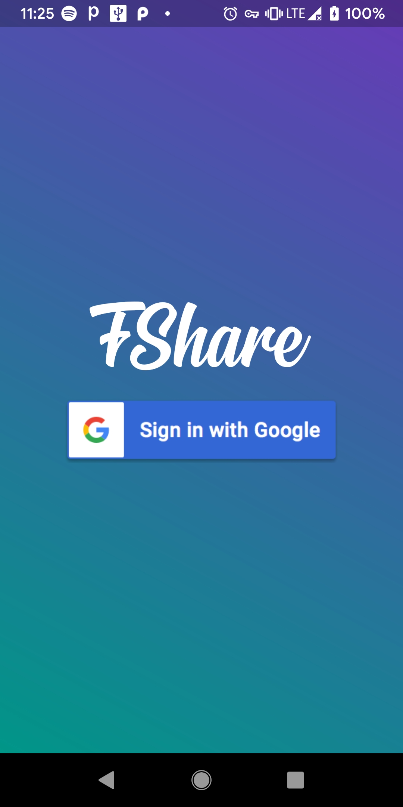
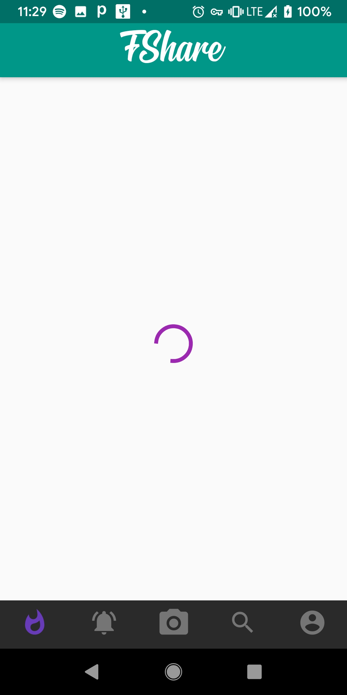

# Fshare
A simple social media app build with flutter.</br>
**Fshare**- Using this application users can log in and register using the Google account and set up their profile then the user can add posts to their timeline,</br>
follow other users,  and can see others post, etc. </br>

<p align="center">
</br></p>


## How to Use 

**Step 1:**

Download or clone this repo by using the link below:

```https://github.com/Suryansh1004/Fshare-Flutter.git```

**Step 2:**

Run the following command in terminal to get the required dependencies: 

```
flutter pub get 
```

**Step 3:**

You may find Folder `fshare-master` , it contains main codebase for the project. 
Go to the `fshare-master` folder and run the following command.

``` 
flutter run
```
You will be able to run the project Successfully with the help of these steps.

## Features

 - Upload/Post images to your profile and can also add location.
 - Send follow requests to other users.
 - Like, comment on the posts of other user.


### Technologies Used

## [Flutter](https://flutter.dev/) </br>
 Flutter is Google’s UI toolkit for building beautiful, natively compiled applications for mobile, web, and desktop from a single codebase.

### Installation
 -   For [Windows](https://flutter.dev/docs/get-started/install/windows)
 -   For [MacOS](https://flutter.dev/docs/get-started/install/macos)
 -   For [Linux](https://flutter.dev/docs/get-started/install/linux)
 </br>

## [Firebase](https://firebase.google.com/)

### Folder Structure
Here is the folder structure provided by flutter

```
fshare-master/
|- android
|- assets/images
|- build
|- functions
|- gen
|- ios
|- lib
|- test
```

Here is the folder structure i have been using in this project

```
lib/
|- models/
|- pages/
|- widgets/
|- main.dart
```

Now, more about the lib folder which contains main code of the project.

```
1- pages - This Contains all the screens which will be available in the App.
2- main.dart - This is the starter of the app.
```

### pages

This directory contains all the pages. A separate file is created for each page/screen.

```
pages/
|- activity_feed.dart
|- comments.dart
|- create_account.dart
|- edit_profile.dart
|- home.dart
|- post_screen.dart
|- profile.dart
|- search.dart
|- timeline.dart
|- upload.dart
```
## ScreenShots
 <p align="center">




</p>
 
  <br>
If you liked this project, don’t forget to ⭐ star the repo to show your support.

